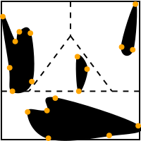
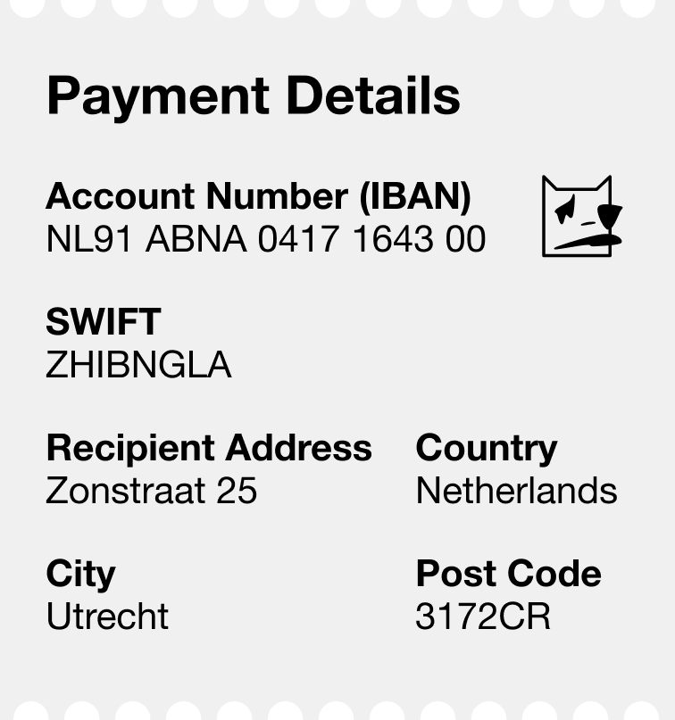

# Randomface

Randomface is JS/React package for generating vector face-like figures from SHA-256 hash.

<p align="center">
    <picture>
        <source media="(prefers-color-scheme: dark)" srcset="assets/example-faces/randomface-2de32b9.svg">
        
    </picture>
    <picture>
        <source media="(prefers-color-scheme: dark)" srcset="assets/example-faces/randomface-4ebf310.svg">
        
    </picture>
    <picture>
        <source media="(prefers-color-scheme: dark)" srcset="assets/example-faces/randomface-4eabff7.svg">
        
    </picture>
    <picture>
        <source media="(prefers-color-scheme: dark)" srcset="assets/example-faces/randomface-5041747.svg">
        
    </picture>
    <picture>
        <source media="(prefers-color-scheme: dark)" srcset="assets/example-faces/randomface-9dbf383.svg">
        
    </picture>
    <picture>
        <source media="(prefers-color-scheme: dark)" srcset="assets/example-faces/randomface-f9ceb52.svg">
        
    </picture>
    <picture>
        <source media="(prefers-color-scheme: dark)" srcset="assets/example-faces/randomface-ba97117.svg">
        
    </picture>
</p>

## About

### Why?

Although various random face/avatar [generators](https://github.com/drhus/awesome-identicons) have existed for a long time, none of them provide genuine randomness in face generation. Many rely on pre-defined images of facial features combined with repetitive patterns, which diminishes the uniqueness and individuality of generated faces.

Randomface takes a different approach by keeping only the positions of facial features fixed while randomizing everything else. This results in a vast range of simple abstract facial expressions, making each face unique and easily distinguishable even in large groups.

And it is lightweight - it doesn't have any external dependencies and outputs a plain SVG. The only requirement is a SHA-256 hash for a face input, which should not be a problem to obtain on any modern platform.

### How it works?

1. Randomface expects a SHA-256 hash on input (_hashing algorithm is not included in the package_).

2. The hash in decimal form is split into pairs of two-digit numbers, representing coordinates:

   ```
   10298733624955409702... => [10, 29], [87, 33], [62, 49], [55, 40], [97, 2]...
   ```

3. 100x100 square is divided into four sectors to accommodate various facial features:

   <picture>
   <source media="(prefers-color-scheme: dark)" srcset="assets/algorithm/face-areas.svg">
   
   </picture>

4. Pairs of two-digit numbers are plotted on the square, sorted and connected in each sector:

   <picture>
   <source media="(prefers-color-scheme: dark)" srcset="assets/algorithm/face-areas-with-dots-connected.svg">
   
   </picture>

### How to use it?

Refer to [JS/TS](packages/randomface/README.md) and [React](packages/randomface-react/README.md) packages documentation

### Where to use it?

Besides obvious use case of a generating random avatars, randomface was actually created as a variation of [Chernoff face](https://en.m.wikipedia.org/wiki/Chernoff_face) implementation for everyday uses.

Our brains are exceptionally proficient in recognizing faces, yet the same aptitude does not apply when it comes to processing textual data.
Verifying checksums, cryptographic keys, passwords, cryptocurrency addresses, UUIDs, bank accounts, etc., through visual inspection is cognitively demanding and prone to errors.

By giving the data a face, we can leverage the innate and effective process of facial recognition (enchanced with emotion detection) to handle visual verification tasks.

A real world example where Chernoff face can be useful - visual verification of payment details:

> Entering a bank account number manually for a money transfer can be both stressful and error-prone, particularly when dealing with payment details received via post or within copy-protected PDFs. A simple typographical error could lead to funds being mistakenly transferred to an incorrect account.
>
> By incorporating a visual reference, such as a Chernoff face, we can ensure the accuracy of entered data by cross-referencing it with the automatically generated information in the payment form. This additional layer of verification enhances the reliability of the transfer process and minimizes the risk of errors.

<p align="center">
    <picture>
        
    </picture>
    &nbsp; &nbsp; &nbsp; &nbsp;
    <picture>
        
    </picture>
</p>
